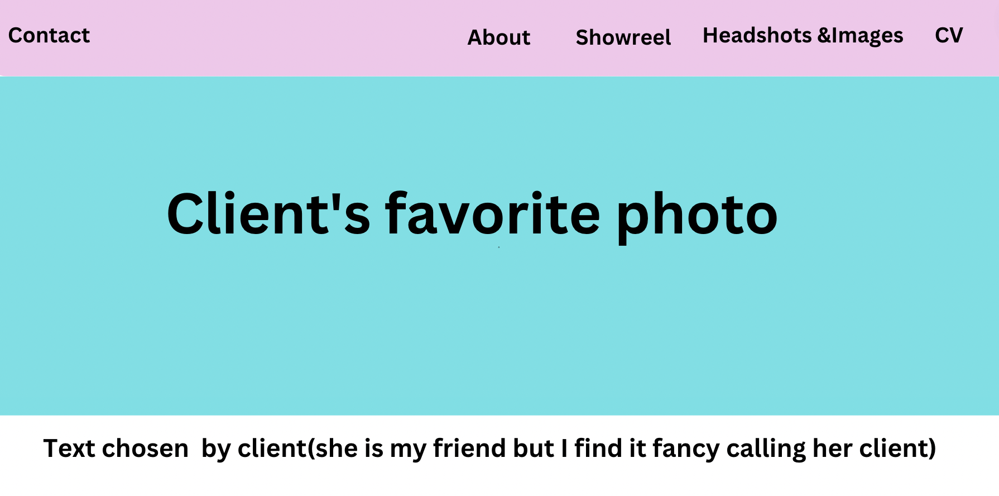
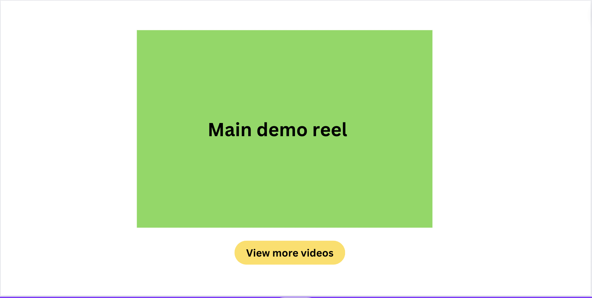
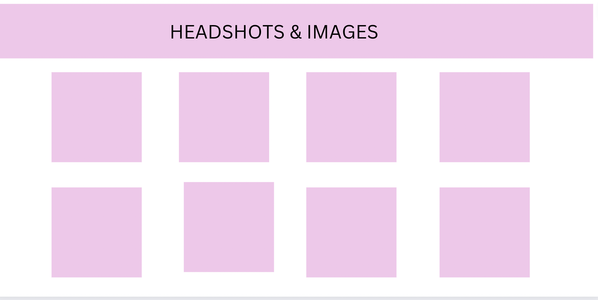
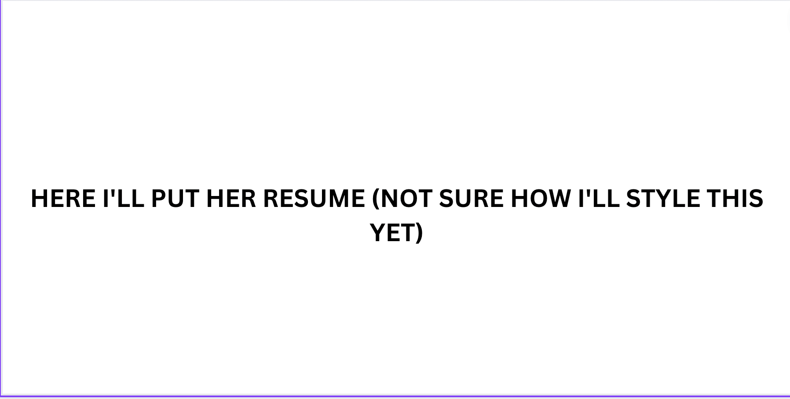
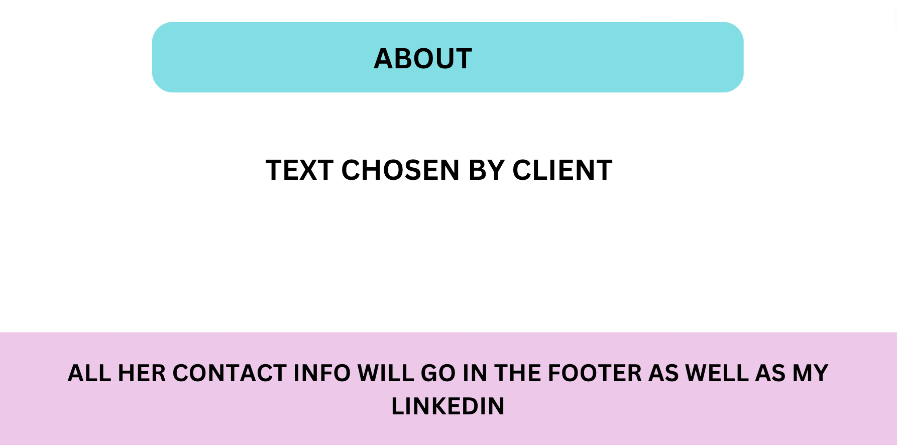

# acting-web
---
My project 4 will be a website i'm making for an actress (friend of mine). The website will be a showcase of her work for casting directors, agents and whoever she wants to send this to. It will have her Demo Reel, headshots, contact, CV and more. The idea is to put all of her material on an easy website that any casting director in a hurry would be able to quickly access what they need.

## Technologies:

* NextJS
* React
* CSS
* Javacript

## User View/user flow Description:
* The targeted users are Casting Directors, Producers, Agents and other professional of the TV/Movie industry. Since they get hundreds of materials a day, the website needs to be easy to access and quick.

* As a User I would like to quickly access the Demo Reel
* As a User I would like to quickly access the Headshots 
* As a User I would like to quickly access the CV
* As a User I would like to quickly access the contact info

## MVP:

* Display a link to Demo Reel
* Display headshots
* Display CV
* Display Contacts

## Stretch Goals:

* Have a route for each picture (Display picture in a bigger size so casting directors can print if they want to)
* Display the Demo reel in the website itself (not just a link)
* Route that takes to other professional videos of the client 

## Wireframes:

