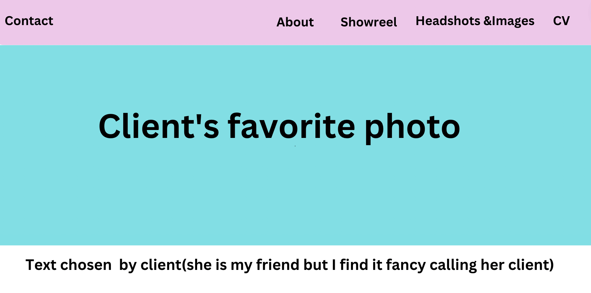
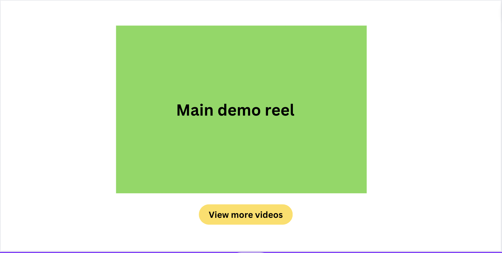
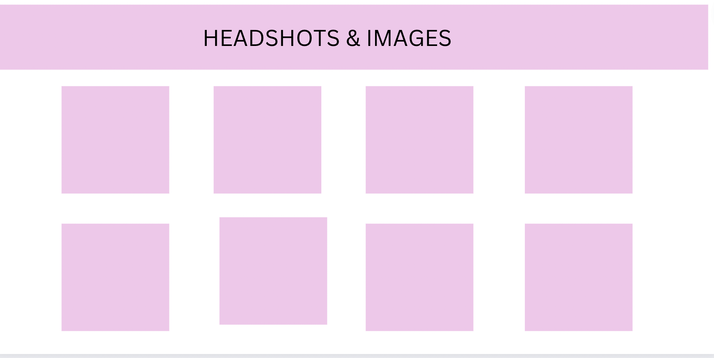
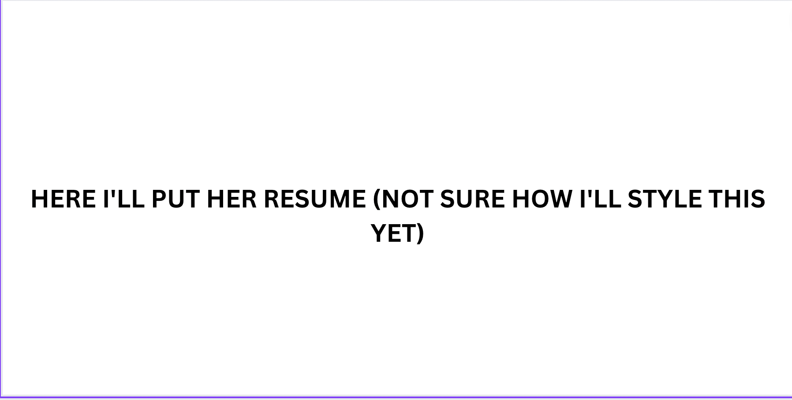
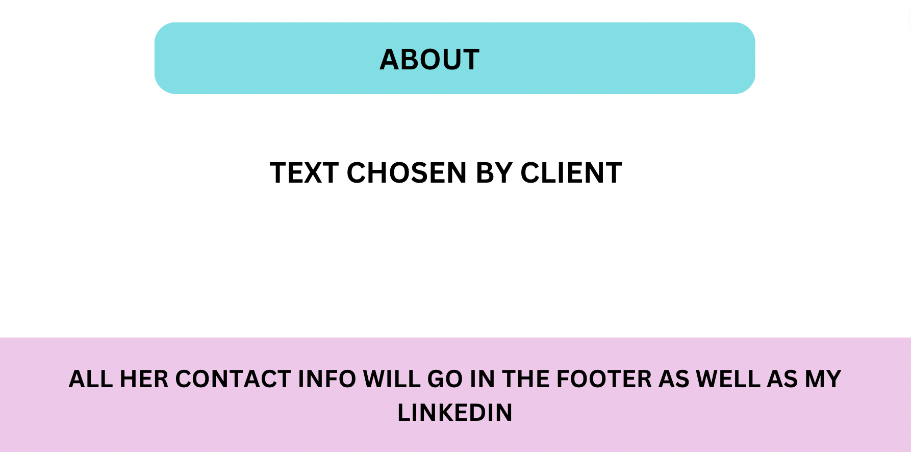

# acting-web
---
My project 4 will be a website i'm making for an actress (friend of mine). The website will be a showcase of her work for casting directors, agents and whoever she wants to send this to. It will have her Demo Reel, headshots, contact, CV and more. The idea is to put all of her material on an easy website that any casting director in a hurry would be able to quickly access what they need.

## Technologies:

* NextJS
* React
* CSS
* Javacript

## User View/user flow Description:
* The targeted users are Casting Directors, Producers, Agents and other professional of the TV/Movie industry. Since they get hundreds of materials a day, the website needs to be easy to access and quick.

* As a User I would like to quickly access the Demo Reel
* As a User I would like to quickly access the Headshots 
* As a User I would like to quickly access the CV
* As a User I would like to quickly access the contact info

## MVP:

* Display a link to Demo Reel
* Display headshots
* Display CV
* Display Contacts

## Stretch Goals:

* Have a route for each picture (Display picture in a bigger size so casting directors can print if they want to)
* Display the Demo reel in the website itself (not just a link)
* Route that takes to other professional videos of the client 

## Wireframes:

## Approach
When I decided to make this website I did not know how I was gonna make a website with little data to be cool and interactive. After I got the material from the client I watched some nextjs tutorials, read the documentation and thought about the target users (casting directors, agents and industry professionals), I realized that the site needs to be easy and as an user I need to be able to find the material I want quickly. Then I started the project. I rendered the basics, styled the basics then I implemented the nav bar and used 2 react packages: one for the social media icons and one for the youtube video. I decided to style it with vanilla css, since it was so easy to meet mvp I decided to take the longer way with styling and practice some of the css that I had not touched since unit1. 

## Unsolved problems
I have a bug (its a hydration issue), I have tried to find where the bug is but did not succeed yet. I think is because I have tailwind installed even though I did not use. We tried to uninstall but it breaks everthung.

## Instalation Instructions
* Fork and clone this repo
* Run npm i (to install packages)
* npm run dev (to start server )
* Open http://localhost:3000/ on your browser